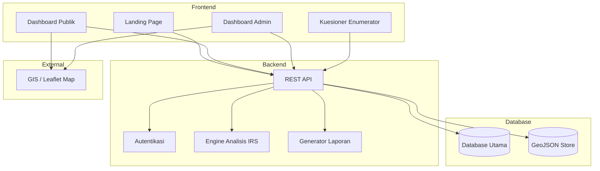
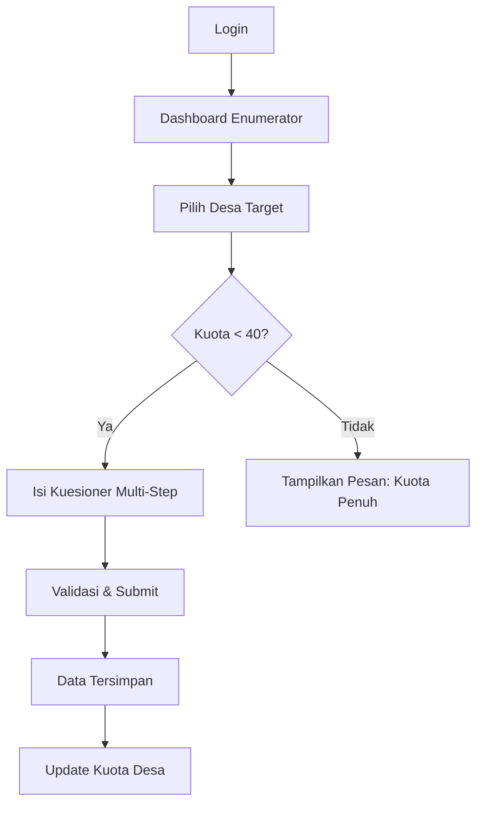
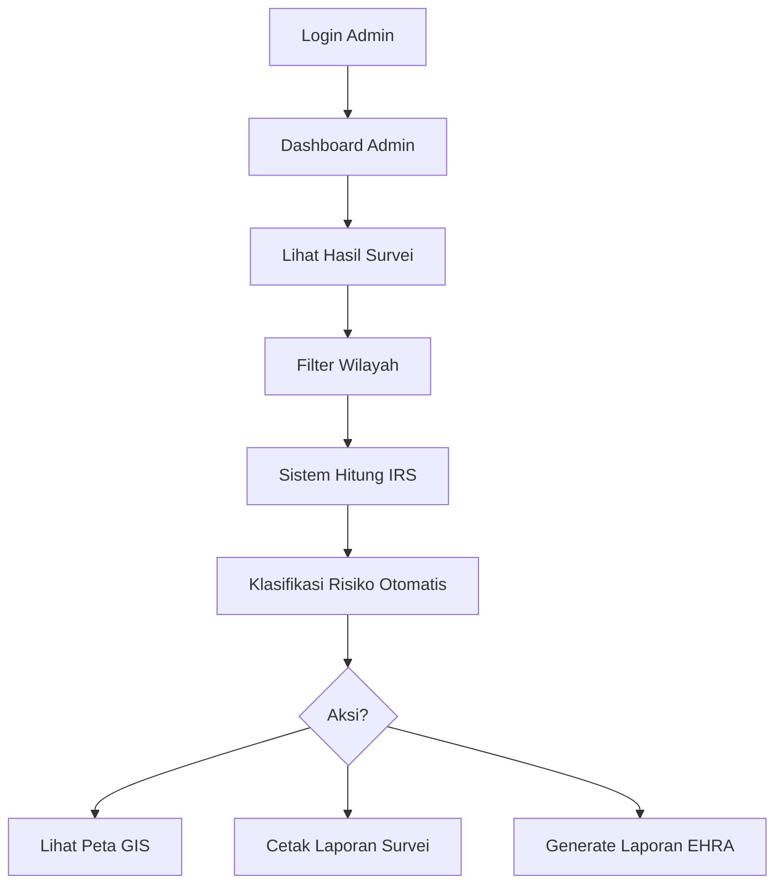

# 📋 Product Requirements Document (PRD)
# Aplikasi EHRA — Environmental Health Risk Assessment

| Field | Detail |
|---|---|
| **Nama Produk** | Aplikasi EHRA |
| **Versi Dokumen** | 1.0 |
| **Tanggal** | 6 Juni 2026 |
| **Status** | Draft — Menunggu Review |

---

## 1. Ringkasan Eksekutif

Aplikasi EHRA adalah platform digital untuk melaksanakan **Studi Penilaian Risiko Kesehatan Lingkungan** (*Environmental Health Risk Assessment*) di tingkat kabupaten/kota seluruh Indonesia. Aplikasi ini mendigitalisasi proses survei sanitasi rumah tangga, menganalisis data secara otomatis untuk mengklasifikasikan tingkat risiko sanitasi setiap desa/kelurahan, dan menyajikan hasilnya melalui peta GIS interaktif serta dashboard analitik.

> [!IMPORTANT]
> Aplikasi ini mengacu pada **Panduan Praktis Pelaksanaan EHRA** dari Kementerian Kesehatan RI dan mendukung penyusunan dokumen **Buku Putih Sanitasi** serta **Strategi Sanitasi Kabupaten/Kota (SSK)**.

---

## 2. Latar Belakang & Permasalahan

### 2.1 Konteks
Studi EHRA adalah survei partisipatif yang dikoordinasikan oleh Pokja Sanitasi Kabupaten/Kota untuk:
- Mengumpulkan data primer kondisi fasilitas sanitasi dan perilaku higiene masyarakat
- Memetakan area berisiko berdasarkan **Indeks Risiko Sanitasi (IRS)**
- Menjadi dasar penyusunan kebijakan sanitasi daerah

### 2.2 Masalah yang Diselesaikan

| Masalah | Solusi Aplikasi |
|---|---|
| Pengumpulan data survei masih manual (kertas) | Kuesioner digital via aplikasi |
| Analisis data memakan waktu lama | Perhitungan IRS otomatis oleh sistem |
| Pemetaan risiko sulit divisualisasikan | Peta GIS interaktif dengan warna per kategori risiko |
| Laporan sulit dihasilkan dan distandarkan | Generate laporan EHRA otomatis (PDF) |
| Tidak ada batasan kualitas data survei | Pembatasan maks. 40 responden per desa |

---

## 3. Tujuan Produk

1. **Digitalisasi survei EHRA** — menggantikan proses manual dengan kuesioner digital
2. **Otomatisasi analisis** — menghitung Indeks Risiko Sanitasi dan mengklasifikasikan tingkat risiko secara otomatis
3. **Visualisasi data** — menyajikan hasil melalui peta GIS, grafik batang, dan pie chart
4. **Pelaporan standar** — menghasilkan laporan EHRA sesuai format resmi Kementerian Kesehatan
5. **Akses publik** — menyediakan dashboard terbuka bagi masyarakat dan stakeholder

---

## 4. Definisi Pengguna (User Roles)

### 4.1 Public User (Non-Login)
| Aspek | Detail |
|---|---|
| **Deskripsi** | Masyarakat umum, stakeholder, media, akademisi |
| **Akses** | Tanpa autentikasi |
| **Tujuan** | Melihat hasil pemetaan risiko sanitasi secara visual |

### 4.2 Admin
| Aspek | Detail |
|---|---|
| **Deskripsi** | Pokja Sanitasi, Dinas Kesehatan, koordinator studi EHRA |
| **Akses** | Login dengan autentikasi |
| **Tujuan** | Mengelola survei, menganalisis data, mencetak laporan, mengelola enumerator |

### 4.3 Enumerator
| Aspek | Detail |
|---|---|
| **Deskripsi** | Petugas lapangan (kader PKK, Posyandu, Sanitarian, TSL) |
| **Akses** | Login dengan autentikasi |
| **Tujuan** | Mengisi kuesioner EHRA di lapangan |

---

## 5. Fitur Detail Per Role

### 5.1 Public User (Non-Login)

#### 5.1.1 Landing Page
- Halaman utama informatif tentang studi EHRA
- Navigasi menuju dashboard publik
- Informasi umum tentang sanitasi dan tujuan studi

#### 5.1.2 Dashboard Publik

**A. Peta GIS Interaktif**
- Menampilkan peta Indonesia dengan layer GeoJSON per kelurahan/desa
- Setiap area diwarnai berdasarkan klasifikasi risiko:

| Kategori | Warna (Rekomendasi) |
|---|---|
| Tidak Berisiko | 🟢 Hijau |
| Kurang Berisiko | 🔵 Biru |
| Sedang | 🟡 Kuning |
| Tinggi | 🟠 Oranye |
| Sangat Tinggi | 🔴 Merah |

- Klik area → menampilkan popup detail (nama desa, skor IRS, jumlah responden, kategori risiko)
- Filter berdasarkan kabupaten/kota

**B. Grafik Batang**
- Menampilkan distribusi tingkat risiko per kelurahan/desa dalam satu kabupaten/kota
- Sumbu X: nama kelurahan/desa
- Sumbu Y: skor Indeks Risiko Sanitasi
- Warna bar sesuai kategori risiko
- Filter: pilih kabupaten/kota

**C. Pie Chart**
- Menampilkan proporsi jumlah desa/kelurahan berdasarkan kategori risiko
- Label: jumlah dan persentase per kategori
- Filter: per kabupaten/kota

---

### 5.2 Admin

#### 5.2.1 Dashboard Admin
- Ringkasan statistik: total survei, total desa tersurvei, distribusi risiko
- Grafik tren dan progress survei
- Notifikasi dan aktivitas terbaru

#### 5.2.2 Manajemen Hasil Survei
- Daftar semua hasil survei yang masuk
- Filter & pencarian berdasarkan: kabupaten/kota, kecamatan, kelurahan/desa, enumerator, tanggal
- Detail jawaban kuesioner per responden
- Status survei per desa (jumlah responden / maks. 40)

> [!IMPORTANT]
> **Business Rule:** Setiap desa/kelurahan dibatasi **maksimal 40 survei**. Setelah kuota terpenuhi, sistem harus mengunci dan menolak survei baru untuk desa tersebut.

#### 5.2.3 Hasil Analisis & Klasifikasi Risiko
- Tabel hasil klasifikasi tingkat risiko per desa/kelurahan
- **Filter bertingkat:**
  - Kabupaten/Kota → Kecamatan → Kelurahan/Desa
- Detail perhitungan IRS per komponen sanitasi:
  - Air minum, Jamban, Air limbah domestik, Persampahan, Drainase, PHBS/CTPS
- Visualisasi: peta GIS, grafik, tabel rekap

#### 5.2.4 Cetak Laporan Hasil Survei
- Export data survei mentah ke format PDF/Excel
- Filter berdasarkan wilayah dan periode
- Template laporan terstandarisasi

#### 5.2.5 Generate Laporan EHRA
- Pembuatan laporan EHRA otomatis berdasarkan hasil analisis sistem
- Format sesuai standar Kementerian Kesehatan
- Konten laporan meliputi:
  - Profil wilayah studi
  - Metodologi dan cakupan survei
  - Hasil analisis per komponen sanitasi
  - Peta area berisiko
  - Kesimpulan dan rekomendasi
- Output: PDF siap cetak

#### 5.2.6 Manajemen Kuesioner
- Melihat dan mengelola daftar pertanyaan kuesioner EHRA
- Mengatur urutan dan kategori pertanyaan
- Preview kuesioner

#### 5.2.7 Manajemen Pengguna (Enumerator)
- CRUD akun enumerator
- Assign enumerator ke wilayah tertentu
- Monitoring aktivitas dan progress survei per enumerator
- Reset password enumerator

---

### 5.3 Enumerator

#### 5.3.1 Kuesioner EHRA (Digital)
- Form kuesioner multi-step sesuai standar EHRA
- Struktur kuesioner:

| Bagian | Cakupan |
|---|---|
| **Identitas** | Wilayah (kabupaten, kecamatan, kelurahan, RT/RW), data responden |
| **Air Minum** | Sumber air, kualitas, pengelolaan air minum rumah tangga |
| **Jamban** | Ketersediaan, jenis, kondisi jamban |
| **Air Limbah** | Sistem pembuangan air limbah domestik (SPAL) |
| **Persampahan** | Pengelolaan sampah, layanan pengangkutan |
| **Drainase** | Kondisi saluran air lingkungan |
| **PHBS** | Cuci tangan pakai sabun (CTPS), perilaku hygiene |
| **Pengamatan** | Observasi langsung enumerator terhadap kondisi lingkungan |

- Auto-save progress pengisian
- Validasi input wajib sebelum submit
- Capture koordinat GPS lokasi survei (opsional)
- Indikator kuota tersisa per desa

#### 5.3.2 Profil Pengguna
- Lihat dan edit data profil diri
- Ubah password
- Riwayat survei yang telah diisi

---

## 6. Spesifikasi Data

### 6.1 Data yang Dibutuhkan

| No | Data | Sumber | Format |
|---|---|---|---|
| 1 | Daftar Kuesioner EHRA | Kemenkes RI / Pokja Sanitasi | Terstruktur (database) |
| 2 | Daftar Kabupaten/Kota, Kecamatan, Kelurahan se-Indonesia | BPS / Kemendagri | CSV / Database |
| 3 | File GeoJSON kelurahan Indonesia | BIG / OpenStreetMap | `.geojson` |
| 4 | Rumus perhitungan IRS | Panduan EHRA Kemenkes | Formula (implementasi kode) |

### 6.2 Indeks Risiko Sanitasi (IRS) — Logika Perhitungan

```
1. Hitung Indeks Risiko per sumber bahaya:
   IR = (Jumlah Responden Berisiko / Total Sampel per Kawasan) × 100%

2. Kalkulasi per parameter:
   Nilai = IR(%) × Bobot Sumber Bahaya(%)

3. IRS Kumulatif = Σ Nilai semua parameter

4. Penentuan Kategori dengan Interval:
   Interval = (IRS Maks − IRS Min) / Jumlah Kategori (5)

   Kategori:
   - Tidak Berisiko  : IRS Min → IRS Min + 1×Interval
   - Kurang Berisiko  : IRS Min + 1×Interval → IRS Min + 2×Interval
   - Sedang           : IRS Min + 2×Interval → IRS Min + 3×Interval
   - Tinggi           : IRS Min + 3×Interval → IRS Min + 4×Interval
   - Sangat Tinggi    : IRS Min + 4×Interval → IRS Maks
```

> [!NOTE]
> Bobot per variabel sanitasi ditentukan oleh Pokja Sanitasi Kabupaten/Kota mengacu pada Juknis EHRA Kemenkes. Sistem harus mendukung **konfigurasi bobot yang fleksibel** agar bisa disesuaikan per daerah.

---

## 7. Arsitektur Sistem (Rekomendasi)



### 7.1 Tech Stack (Rekomendasi)

| Layer | Teknologi |
|---|---|
| **Frontend** | Laravel Blade / Vue.js |
| **Backend** | Laravel (PHP) |
| **Database** | MySQL / PostgreSQL |
| **Peta GIS** | Leaflet.js + GeoJSON |
| **Grafik** | Chart.js / ApexCharts |
| **Laporan PDF** | DomPDF / Snappy |
| **Autentikasi** | Laravel Sanctum / Session-based |

---

## 8. User Flow Utama

### 8.1 Flow Enumerator — Pengisian Kuesioner



### 8.2 Flow Admin — Analisis & Laporan



---

## 9. Business Rules

| No | Rule | Detail |
|---|---|---|
| BR-01 | Batas survei per desa | Maksimal **40 survei** per desa/kelurahan. Sistem mengunci setelah kuota penuh. |
| BR-02 | Akses data publik | Dashboard publik hanya menampilkan data agregat (klasifikasi risiko), bukan data individual responden. |
| BR-03 | Hierarki wilayah | Data diorganisasi: Provinsi → Kabupaten/Kota → Kecamatan → Kelurahan/Desa. |
| BR-04 | Bobot IRS fleksibel | Bobot perhitungan IRS bisa dikonfigurasi per kabupaten/kota oleh admin. |
| BR-05 | Validasi kuesioner | Semua field wajib harus diisi sebelum submit. |
| BR-06 | Hak akses | Enumerator hanya bisa mengisi survei, tidak bisa melihat data analisis atau mengelola pengguna lain. |

---

## 10. Non-Functional Requirements

| Aspek | Requirement |
|---|---|
| **Performa** | Peta GIS harus load dalam < 3 detik untuk 1 kabupaten |
| **Skalabilitas** | Mendukung data seluruh Indonesia (~83.000 desa/kelurahan) |
| **Responsif** | Kuesioner harus mobile-friendly (enumerator di lapangan) |
| **Keamanan** | Data responden bersifat rahasia, hanya admin yang bisa akses detail |
| **Reliabilitas** | Auto-save kuesioner untuk mencegah kehilangan data |
| **Kompatibilitas** | Support browser modern (Chrome, Firefox, Safari, Edge) |

---

## 11. Rencana Pengembangan (Phased Delivery)

### Phase 1 — MVP (Prioritas Tinggi)
- [x] Setup project & database schema
- [ ] Data master wilayah (Kabupaten → Kelurahan) se-Indonesia
- [ ] Autentikasi (Admin & Enumerator)
- [ ] Kuesioner EHRA digital (multi-step form)
- [ ] Manajemen pengguna (CRUD enumerator)
- [ ] Pembatasan 40 survei per desa

### Phase 2 — Analisis & Visualisasi
- [ ] Engine perhitungan Indeks Risiko Sanitasi (IRS)
- [ ] Klasifikasi risiko otomatis (5 kategori)
- [ ] Integrasi GeoJSON & peta GIS (Leaflet.js)
- [ ] Dashboard publik (peta, grafik batang, pie chart)
- [ ] Filter bertingkat (kabupaten → kecamatan → kelurahan)

### Phase 3 — Pelaporan & Polish
- [ ] Cetak laporan hasil survei (PDF/Excel)
- [ ] Generate laporan EHRA otomatis (PDF)
- [ ] Landing page publik
- [ ] Dashboard admin lengkap
- [ ] Optimasi performa peta GIS

---

## 12. Open Questions

> [!WARNING]
> Berikut pertanyaan yang perlu diklarifikasi sebelum pengembangan dimulai:

1. **Kuesioner EHRA**: Apakah sudah ada daftar pertanyaan kuesioner EHRA yang spesifik akan digunakan? Atau mengacu pada template resmi Kemenkes?

2. **Bobot IRS**: Apakah bobot perhitungan IRS per komponen sanitasi sudah ditentukan, atau perlu fitur untuk admin mengatur bobot sendiri?

3. **Cakupan wilayah**: Apakah aplikasi ini digunakan untuk **seluruh Indonesia** atau fokus pada kabupaten/kota tertentu terlebih dahulu?

4. **Data GeoJSON**: Apakah sudah tersedia file GeoJSON kelurahan Indonesia, atau perlu disiapkan?

5. **Multi-tenancy**: Apakah satu instance aplikasi melayani satu kabupaten/kota atau bisa multi-kabupaten?

6. **Offline capability**: Mengingat enumerator bekerja di lapangan, apakah dibutuhkan kemampuan offline untuk pengisian kuesioner?

7. **Role tambahan**: Apakah ada role selain Admin dan Enumerator (misal: Supervisor, Viewer per SKPD)?

---

## 13. Referensi

- Panduan Praktis Pelaksanaan EHRA — Kementerian Kesehatan RI
- Pedoman Penyusunan Buku Putih Sanitasi
- Strategi Sanitasi Kabupaten/Kota (SSK)
- 5 Pilar STBM (Sanitasi Total Berbasis Masyarakat)
